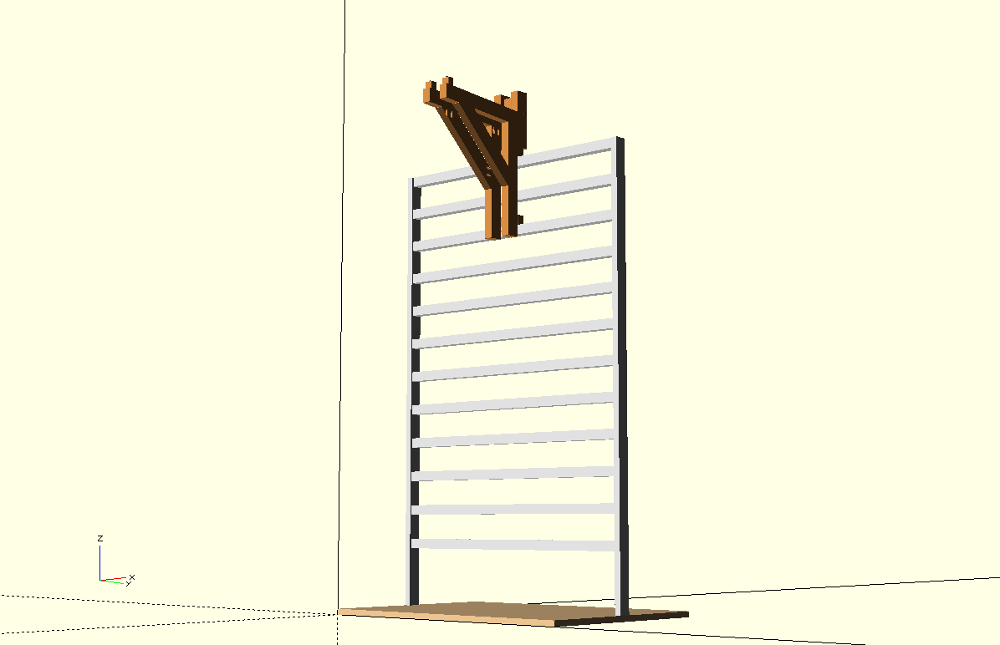
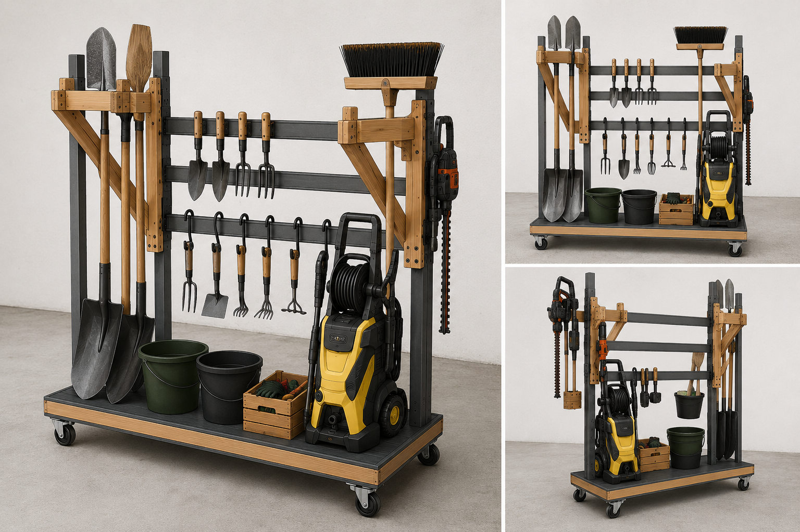
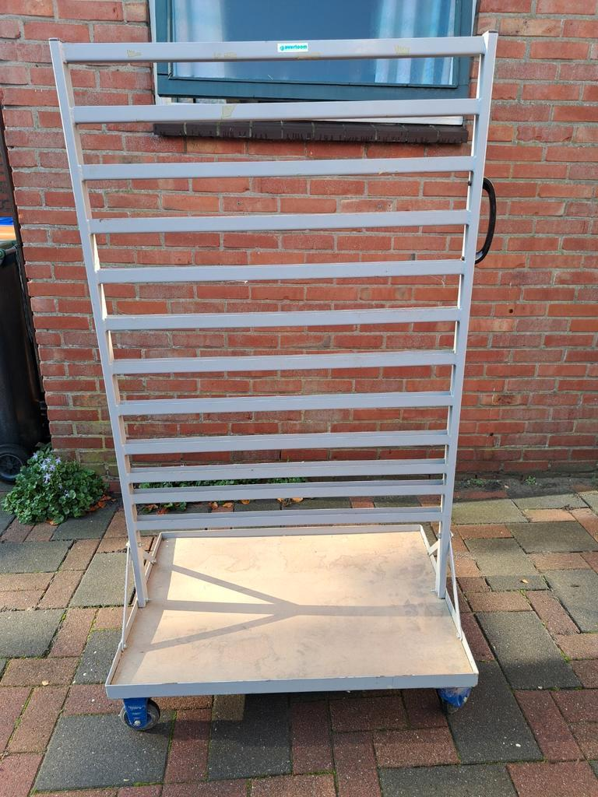

# Garden Tool Cart

> This project, including the OpenSCAD model and documentation, was created with the assistance of ChatGPT. Dimensions and design details should be verified before building.

OpenSCAD model for a garden tool storage cart, based on an existing mobile metal rack with horizontal U-profiles.

The goal is to develop simple modular holders that attach to the existing rack for storing garden tools such as shovels, brooms, hoes and smaller hand tools.

## Current status

**Early concept / work in progress.**

The current OpenSCAD model focuses on the existing cart and the first wooden holder for long-handled tools.

The design currently explores:

- 27 × 44 mm timber construction
- attachment to the existing U-profiles
- wooden arms and diagonal braces
- pocket-hole and screw connections
- adjustable arm and brace angles
- basic cut-list information through `echo()`

Dimensions, connections and construction details are still being evaluated and may change.

## OpenSCAD model

`main.scad` is the main entry point and contains the OpenSCAD Customizer options.

More information about the model structure, configuration and views can be found in [model.md](model.md).

## Current model

The image below shows the current state of the OpenSCAD model.

## Concept impression

The cart is intended to use both sides of the existing rack. A possible future setup could combine holders for shovels and brooms with hooks for hoes and other garden tools.

The other side can provide space for larger equipment such as a pressure washer, together with a hedge trimmer, buckets and smaller tools.

This is only an impression of the intended use. The final arrangement and individual holders will evolve as the design develops.

## Starting point

The project is based on an existing mobile metal rack. Its horizontal U-profiles provide the mounting points for the new modular holders.

The rack itself will remain largely unchanged.

